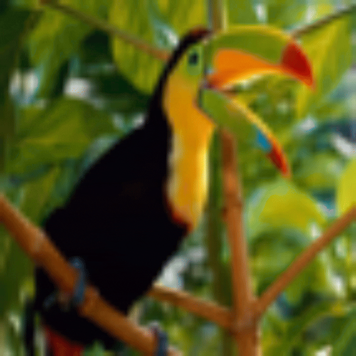
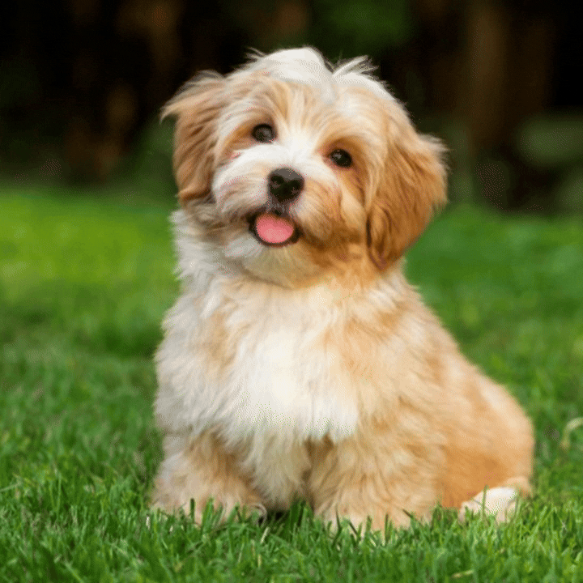
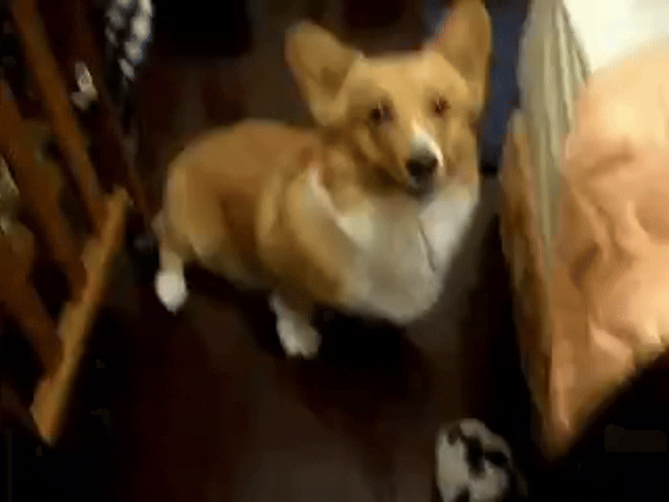
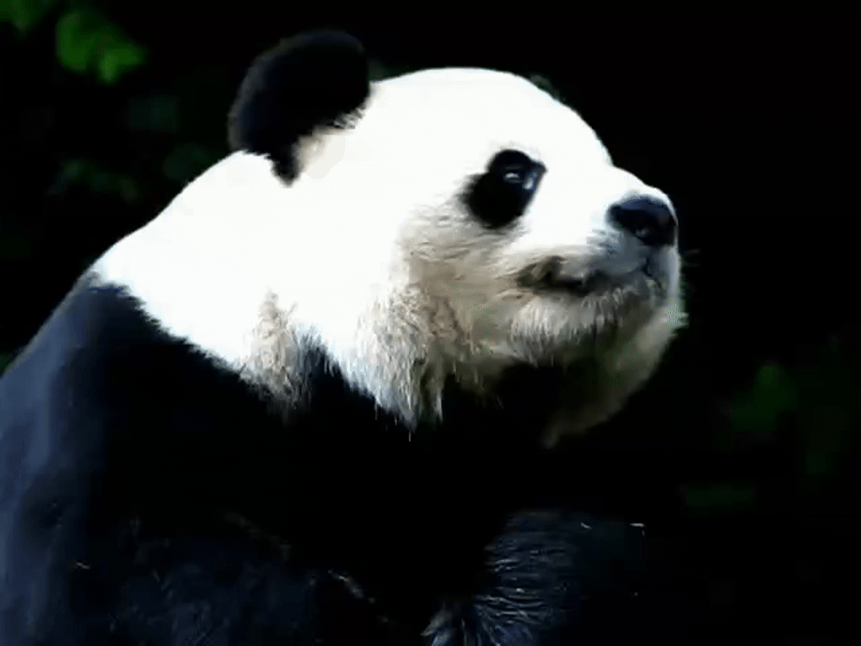
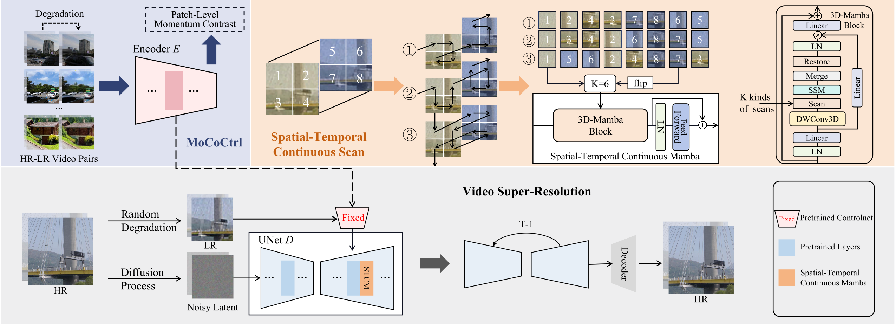

<div align="center">

<h1>
    <br> 
    Self-supervised ControlNet with Spatio-Temporal Mamba for Real-world Video Super-resolution(CVPR2025)
</h1>

Shijun Shi<sup>1*</sup>, Jing Xu<sup>2*</sup>, Lijing Lu<sup>3&dagger;</sup>, Zhihang Li<sup>4&dagger;</sup>, Kai Hu<sup>1</sup>

_<sup>1</sup>Jiangnan University_  
_<sup>2</sup>University of Science and Technology of China_  
_<sup>3</sup>Peking University_ 
_<sup>4</sup>Chinese Academy of Sciences_  

<div>
    <h4 align="center">
        <a href="https://ssj9596.github.io/scst-project/" target='_blank'>
        
        </a>
    </h4>
</div>

</div>


## 🔥 Update
- [2025.03] Inference code and checkpoint is released.


## 📈 Our model can do both ISR and VSR. Hope you can enjoy it.
### Realistic Image SR
 

### Realistic Video SR
 


## 🔧 Dependencies and Installation
1. Clone Repo
    ```bash
    git clone https://github.com/ssj9596/SCST.git
    cd SCST
    ```

2. Create Conda Environment and Install Dependencies
    ```bash
    # create new conda env
    conda create -n SCST python=3.10
    conda activate SCST

    # install python dependencies
    pip install -r requirements.txt
    ```

3. Download Models

   - Download pretrained models from [huggingface](https://huggingface.co/MochunniaN1/SCST) and put them under the `checkpoints` folder.
   - Download [SD2.1](https://huggingface.co/stabilityai/stable-diffusion-2-1-base) and put them into ``checkpoints/stable-diffusion-2-1-base``. 

   The [`checkpoints`](./checkpoints) directory structure should be arranged as:

    ```
    ├── checkpoints
    │   ├── controlnet
    │   ├── stable-diffusion-2-1-base
    │   ├── localatten_unet.pth
    │   ├── mococtrl_unet.pth
    │   ├── stcm_unet.pth
  
    ```

## ☕️ Quick Inference


We provide several examples in the [`inputs`](./inputs) folder. 
Run the following commands to try it out:

```shell
## Single Image 
## no temporal module
python inference/infer_mococtrl.py 
```


```shell
## Video
## use LocalAttention as temporal module
python inference/infer_localatten.py
## use Mamba as temporal module
python inference/infer_stcm.py
```

You can enter the script to modify the input path.


## 🎬 Overview



<!-- ## 📑 Citation

   If you find our repo useful for your research, please consider citing our paper:

   ```bibtex
   ``` -->


## Acknowledgments
Our project is based on [diffusers](https://github.com/huggingface/diffusers).Some codes are brought from [MGLD](https://github.com/IanYeung/MGLD-VSR) and [PASD](https://github.com/yangxy/PASD). Thanks for their awesome works.


## 📧 Contact
If you have any questions, please feel free to reach us at `ssj180123@gmail.com`
